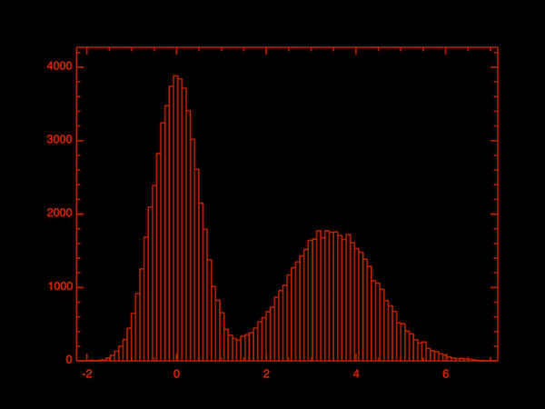
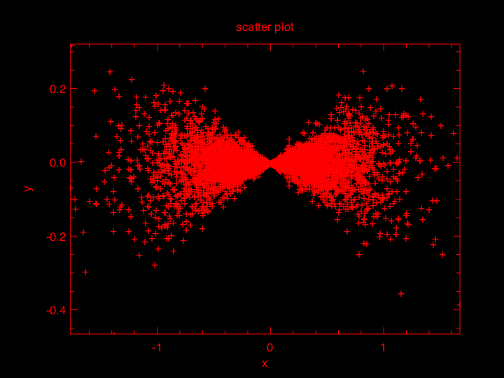

# Owl - An OCaml Numerical Library
Owl is an OCaml numerical library. It supports N-dimensional arrays, both dense and sparse matrix operations, linear algebra, regressions, fast Fourier transforms, and many advanced mathematical and statistical functions (such as Markov chain Monte Carlo methods). Recently, Owl has implemented algorithmic differentiation which essentially makes developing machine learning and neural network algorithms trivial. [](https://travis-ci.org/ryanrhymes/owl)


## Learning

Here are some learning material to help you start with Owl. The full API documentation is recently built on 17th August, 2017:

* on [cl.cam.ac.uk](http://www.cl.cam.ac.uk/~lw525/owl/)

This [How-To?](https://github.com/ryanrhymes/owl/wiki/How-To%3F) maintains a list of practical tips. The series of tutorials is here (more are coming):

* [Tutorial 1: Basic Data Types](https://github.com/ryanrhymes/owl/wiki/Tutorial:-Basic-Data-Types)
* [Tutorial 2: N-dimensional Array](https://github.com/ryanrhymes/owl/wiki/Tutorial:-N-Dimensional-Array)
* [Tutorial 3: Matrix Manipulation](https://github.com/ryanrhymes/owl/wiki/Tutorial:-Matrix-Manipulation)
* [Tutorial 4: How to Plot in Owl?](https://github.com/ryanrhymes/owl/wiki/Tutorial:-How-to-Plot-in-Owl%3F)
* [Tutorial 5: Metric Systems](https://github.com/ryanrhymes/owl/wiki/Tutorial:-Metric-Systems)
* [Tutorial 6: Indexing and Slicing](https://github.com/ryanrhymes/owl/wiki/Tutorial:-Indexing-and-Slicing)
* [Tutorial 7: Broadcasting Operation](https://github.com/ryanrhymes/owl/wiki/Tutorial:-Broadcasting-Operation)
* [Tutorial 8: Operators and Ext Module](https://github.com/ryanrhymes/owl/wiki/Tutorial:-Operators-and-Ext-Module)
* [Tutorial 9: Linear Algebra](https://github.com/ryanrhymes/owl/wiki/Tutorial:-Linear-Algebra)
* [Tutorial 10: Algorithmic Differentiation](https://github.com/ryanrhymes/owl/wiki/Tutorial:-Algorithmic-Differentiation)
* [Tutorial 11: Neural Network](https://github.com/ryanrhymes/owl/wiki/Tutorial:-Neural-Network)
* [Tutorial 12: Scripting and Zoo System](https://github.com/ryanrhymes/owl/wiki/Tutorial:-Scripting-and-Zoo-System)

The Presentation Slides in OCaml Workshop 2017 can be viewed with [this link](https://docs.google.com/presentation/d/1A-7KiQLot3X2lLyZntrFGxsxaNir0g_2TlruBP4W2Uc/edit).
The tutorial material of Owl in CUFP 2017 can be accessed with [this link](https://docs.google.com/presentation/d/1EB4B6xAc81ypUGze22qESnFixZWIK31OaNZ8n0ndC6w/edit?usp=sharing).

Some simple evaluations can be found [[here](https://github.com/ryanrhymes/owl/wiki/Evaluation:-Performance-Test)]. The roadmap and future plan of Owl can be found
[[Here]](https://github.com/ryanrhymes/owl/wiki/Future-Plan). I would love to hear from you, and please let me know your comments and suggestions to improve Owl.

[Email Me](mailto:liang.wang@cl.cam.ac.uk) or message me on:
[Twitter](https://twitter.com/ryan_liang),
[Google+](https://www.google.com/+RyanLiang),
[Facebook](http://www.facebook.com/ryan.liang.wang),
[Blogger](http://ryanrhymes.blogspot.com/),
[LinkedIn](http://uk.linkedin.com/in/liangsuomi/)


## Installation

Owl requires OCaml `>=4.04.0`. The installation is rather trivial. You can simply use `opam install owl` to start. Owl's current version on OPAM is `0.2.6`, and it lags behind the master branch and misses many new features. If you want to try the newest version, I recommend installing Owl from the source and I will briefly show you how to do that in the following.

First, you need to clone the repository.

```bash
git clone git@github.com:ryanrhymes/owl.git
```

Then you need to install all the dependencies. The following dependencies may require you to install extra system libraries (e.g., Plplot) but `opam depext` can help you sort that out automatically.

```bash
opam install ctypes dolog eigen gsl oasis plplot atdgen
```

The most important dependency is [OpenBLAS](https://github.com/xianyi/OpenBLAS). Linking to the correct OpenBLAS is the key to achieve the best performance. Depending on the specific platform, you can use `yum`, `apt-get`, `brew` to install the binary format. For example on Mac OSX,

```bash
brew install homebrew/science/openblas
```

However, installing from OpenBLAS source code leads to way better performance in my own experiment. In future, the dependency on OpenBLAS should also be resolved by `opam` automatically.


Finally, you can compile and install the module with the following command.

```bash
make oasis
make && make install
```

Owl is well integrated with `utop`. Now you can start `utop` and continue this tutorial to do some experiments. If you want `utop` to automatically load Owl for you, you can also edit `.ocamlinit` file in your home folder by adding the following lines. (Note that the library name is `owl` with lowercase `o`.)

```bash
#require "owl"
```

If you are too lazy to do any labour work, here is a [docker image](https://hub.docker.com/r/ryanrhymes/owl/) to let you try Owl without dealing with aforementioned installation and configuration steps. The docker image is automatically build from the master branch whenever there are new commits. You can check the building history on [Docker Hub](https://hub.docker.com/r/ryanrhymes/owl/builds/).

Just pull the image, start a container, then play with it in `utop`. The latest source code is saved in `/root/owl` directory.

```bash
docker pull ryanrhymes/owl
docker run -t -i ryanrhymes/owl
```


## Access Modules

`Owl` currently has the following core modules and their names all start with `Owl_` to avoid name conflicts, e.g., `Owl_dense`, `Owl_sparse`, `Owl_maths`, `Owl_stats`, `Owl_const`, `Owl_fft`, `Owl_plot` and etc. After `utop` successfully loads `Owl` library, you can access the module functions using aforementioned names.

However, a more convenient way is to use `Owl` module as an entry point which provides aliases of the core module names for easy access, e.g., `Owl.Dense` is the same as `Owl_dense`, and `Owl.Regression` is the same as `Owl_regression`. Given no name conflicts, you can simply open the whole `Owl` module for convenience as I will do in the rest of this tutorial.

```ocaml
open Owl;;
```


## Create Matrices

[`Dense.Matrix`](https://github.com/ryanrhymes/owl/blob/master/lib/owl_dense_matrix.ml) module supports dense matrix operations while [`Sparse.Matrix`](https://github.com/ryanrhymes/owl/blob/master/lib/owl_sparse_matrix.ml) module supports sparse ones. There are five submodules in `Dense.Matrix`:

* `Dense.Matrix.S` module supports single precision float numbers `float32`;
* `Dense.Matrix.D` module supports double precision float numbers `float64`;
* `Dense.Matrix.C` module supports single precision complex numbers `complex32`;
* `Dense.Matrix.Z` module supports double precision complex numbers `complex64`;
* `Dense.Matrix.Generic` module supports all aforementioned number types via GADT.

To start, we can use `Dense.Matrix.D.uniform_int` to create a 5x5 random dense matrix.

```ocaml
let x = Dense.Matrix.D.uniform_int 5 5;;
```

You should see the following output in `utop`.

```bash
   C0 C1 C2 C3 C4
R0 25  2 77 85 72
R1 71 92 98 87 53
R2 35 29 82 65 20
R3  2 29 66 42 12
R4 99 72 78 30 11
val x : Owl_dense_matrix_d.mat =
```

To save some typing efforts, we have made `Mat` as an alias of `Dense.Matrix.D` by assuming 64-bit float numbers are commonly used. Therefore, we can use `Mat` directly after open `Owl` instead of using `Dense.Matrix.D`. Similarly, there are also aliases for 64-bit float vectors and ndarrays (i.e., `Vec` and `Arr`) but we will talk about them later. `Mat` module also provides other functions to create various matrices, e.g., as below.

```ocaml
let x = Mat.eye 5;;             (* identity matrix *)
let x = Mat.zeros 5 5;;         (* all elements are zeros *)
let x = Mat.ones 5 5;;          (* all elements are ones *)
let x = Mat.uniform 5 5;;       (* random matrix of uniform distribution *)
let x = Mat.gaussian 5 5;;      (* random matrix of gaussian distribution *)
let x = Mat.triu x;;            (* Upper triangular matrix *)
let x = Mat.toeplitz v;;        (* Toeplitz matrix *)
let x = Mat.hankel v;;          (* Hankel matrix *)
let x = Mat.hadamard 8;;        (* Hadamard matrix *)
let x = Mat.magic 8;;           (* Magic square matrix *)
...
```

Combined with `Stats` module, you can also create any matrices of many distributions. E.g., the following code first creates an empty dense matrix, then initialise the elements with Bernoulli distribution. Test it in `utop`, you should get a dense matrix where half of the elements are zeros.

```ocaml
let x = Mat.empty 8 8 |> Mat.map (fun _ -> Stats.Rnd.bernoulli 0.5 |> float_of_int);;
```

Or create a matrix where the elements follow Laplace distribution.

```ocaml
let x = Mat.empty 8 8 |> Mat.map (fun _ -> Stats.Rnd.laplace 0.2);;
```

With `Dense` module, you can also generate linearly spaced interval and meshgrids, e.g.,

```ocaml
let x = Mat.linspace 0. 5. 6;;
```
which will return a 1x5 row vector as below
```bash
   C0  C1  C2  C3  C4  C5
R0  0   1   2   3   4   5
val x : Owl_dense_matrix_d.mat =
```

The created matrices can be casted into other number types easily. For example the following code casts a `float32` matrix `x` into `complex64` matrix `y`.

```ocaml
let x = Dense.Matrix.S.uniform 3 3;;
let y = Dense.Matrix.Generic.cast_s2z x;;
```

Matrices can be saved to and loaded from a file.

```ocaml
Mat.save x "matrix_01.data";;  (* save the matrix to a file *)
Mat.load "matrix_01.data";;    (* load the matrix from a file *)
```


## Access Elements, Rows, and Columns

Both `Dense.Matrix` and `Sparse.Matrix` modules provide a wide range of operations to access the elements, rows, and columns of a matrix. You can refer to the full document in [`Dense.Matrix.Generic`](https://github.com/ryanrhymes/owl/blob/master/lib/owl_dense_matrix_generic.mli). Here we just gave some simple examples briefly.

You can use `Mat.set` and `Mat.get` to manipulate individual element.

```ocaml
Mat.set x 0 1 2.5;;
Mat.get x 0 1;;
```

Equivalently, there are shorthands for `Mat.get` and `Mat.set`.

```ocaml
x.{0,1} <- 2.5;;  (* Mat.set x 0 1 2.5 *)
x.{0,1};;         (* Mat.get x 0 1 *)
```

We can use `Mat.row` and `Mat.col` to retrieve a specific row or column of a matrix, or use `Mat.rows` and `Mat.cols` to retrieve multiple of them.

```ocaml
Mat.row x 5;;            (* retrieve the fifth row *)
Mat.cols x [|1;3;2|];;   (* retrieve the column 1, 3, and 2 *)
```

E.g., the following code generates a random matrix, then scales up each element by a factor of 10 using `Mat.map` function.

```ocaml
let x = Mat.(uniform 6 6 |> map (fun x -> x *. 10.));;
```

We can iterate a matrix row by row, or column by column. The following code calculates the sum of each row by calling `Mat.map_rows` function.

```ocaml
let x = Mat.(uniform 6 6 |> map_rows sum);;
```

We can fold elements by calling `Mat.fold`, fold rows by calling `Mat.fold_rows`. Similarly, there are also functions for `filter` operations. The following code filters out the elements not greater than 0.1 in x.

```ocaml
Mat.filter ((>) 0.1) x;;    (* not greater than 0.1 in x *)
```

We can also do something more complicated, e.g., by filtering out the rows whose summation is greater than 3.

```ocaml
Mat.filter_rows (fun r -> Mat.sum r > 3.) x;;
```

Shuffle the rows and columns, or draw some of them from a matrix.

```ocaml
Mat.shuffle_rows x;;     (* shuffle the rows in x *)
Mat.draw_cols x 3;;      (* draw 3 columns from x with replacement *)
...
```

Practically, `Sparse.Matrix` module provides a subset of the similar operations for sparse matrices. In addition, `Sparse.Matrix` module also has extra functions such as only iterating non-zero elements `Sparse.Matrix.Generic.iter_nz`, and etc. Please read the full documentation for [`Sparse.Matrix.Generic`](https://github.com/ryanrhymes/owl/blob/master/lib/owl_sparse_matrix_generic.mli) for details.


## Linear Algebra

Simple matrix mathematics like add, sub, multiplication, and division are included in `Dense` module. Moreover, there are predefined shorthands for such operations. E.g., the following code creates two random matrices then compare which is greater.

```ocaml
let x = Mat.uniform 6 6;;
let y = Mat.uniform 6 6;;
Mat.(x > y);;                (* is x greater than y? return boolean *)
Mat.(x = y);;                (* is x equal to y? *)
Mat.(x =~ y);;               (* is x approximately equal to y? *)
Mat.(x <. y);;               (* is x smaller than y? return 0/1 matrix *)
...
```

Owl natively supports broadcast operation similar to other numerical libraries. Some basic math operations includes:

```ocaml
Mat.(x + y);;                (* addition of two matrices *)
Mat.(x * y);;                (* element-wise multiplication *)
Mat.(x *@ y);;               (* matrix multiplication of two matrices *)
Mat.(x +$ 2.);;              (* add a scalar to all elements in x *)
...
```

Apply various functions in `Maths` module to every element in x

```ocaml
Mat.(Maths.atanh @@ x);;        (* apply atanh function *)
Mat.(Maths.airy_Ai @@ x);;      (* apply Airy function *)
...
```

However, it is worth pointing out that `Mat` already implements many useful math functions. These functions are vectorised and are much faster than the example above which actually calls `Mat.map` for transformation.

```ocaml
Mat.sin x;;         (* call sine function *)
Mat.erfc x;;        (* call erfc function *)
Mat.round x;;       (* call round function *)
Mat.signum x;;      (* call signum function *)
Mat.sigmoid x;;     (* apply sigmoid function *)
...
```

Concatenate two matrices, vertically or horizontally by

```ocaml
Mat.(x @= y);;              (* equivalent to Mat.concat_vertical *)
Mat.(x @|| y);;             (* equivalent to Mat.concat_horizontal *)
Mat.concatenate [|x;...|];; (* concatenate a list of matrices along rows *)
```

More advanced linear algebra operations such as `svd`, `qr`, and `cholesky` decomposition are included in `Linalg` module. `Linalg` module also supports both real and complex number of single and double precision.

```ocaml
let u,s,v = Linalg.D.svd x;;     (* singular value decomposition *)
let q,r = Linalg.D.qr x;;        (* QR decomposition *)
let l,u,_ = Linalg.D.lu x;;      (* LU decomposition *)
let l = Linalg.D.chol x;;        (* cholesky decomposition *)
...
let e, v = Linalg.D.eig x;;      (* Eigenvectors and eigenvalues *)
let x = Linalg.D.null a;;        (* Solve A*x = 0, null space *)
let x = Linalg.D.linsolve a b;;  (* Solve A*x = B *)
let a, b = Linalg.D.linreg x y;; (* Simple linear regression y = a*x + b *)
...
```

`Linalg` module offers additional functions to check the properties of a matrix. For example,

```ocaml
Linalg.D.cond x;;          (* condition number of x *)
Linalg.D.rank x;;          (* rank of x *)
Linalg.D.is_diag x;;       (* is it diagonal *)
Linalg.D.is_triu x;;       (* is it upper triangular *)
Linalg.D.is_tril x;;       (* is it lower triangular *)
Linalg.D.is_posdef x;;     (* is it positive definite *)
Linalg.D.is_symmetric x;;  (* is it symmetric *)
...
```

Owl has implemented a complete set of OCaml interface to [`CBLAS`](https://github.com/ryanrhymes/owl/blob/master/lib/owl_cblas_generated.mli) and [`LAPACKE`](https://github.com/ryanrhymes/owl/blob/master/lib/owl_lapacke_generated.mli) libraries. You can utilise these highly optimised functions to achieve the best performance. However in most cases, you should only use the high-level functions in `Linalg` module rather than dealing with these low-level interface.


## Regression

`Regression` module currently includes `linear`, `exponential`, `nonlinear`, `ols`, `ridge`, `lasso`, `svm`, and etc. Most of them are based on a stochastic gradient descent algorithm implemented in `Optimise` module.

In the following, let's use an example to illustrate the simplest linear regression in `Regression` module. First, let's generate the measurement x which is a 1000 x 3 matrix. Each row of x is an independent measurement.

```ocaml
let x = Mat.uniform 1000 3;;
```

Next let's define the parameter of a linear model, namely p, a 3 x 1 matrix.

```ocaml
let p = Mat.of_array [|0.2;0.4;0.8|] 3 1;;
```

Then we generate the observations y from x and p by

```ocaml
let y = Mat.(x *@ p);;
```

Now, assume we only know x and y, how can we fit x and y into a linear model? It is very simple.

```ocaml
let p' = Regression.linear x y;;
```

From `utop`, you can see that p' equals `[|0.2; 0.4; 0.8|]` which is exactly the same as p. For other regression such as `lasso` and `svm`, the operation is more or less the same, please read Owl document for details.


## Plotting

There is another separate [Tutorial on Plotting in Owl](https://github.com/ryanrhymes/owl/wiki/Tutorial:-How-to-Plot-in-Owl%3F).
Herein, let's use an example to briefly show how to plot the result using `Plot` module. We first generate two mesh grids then apply sine function to them by using the operations introduced before.

```ocaml
let x, y = Mat.meshgrid (-2.5) 2.5 (-2.5) 2.5 100 100 in
let z = Mat.(sin ((x * x) + (y * y))) in
Plot.mesh x y z;;
```

No matter what plot terminal you use, you should end up with a figure as below.


Besides `Plot.mesh`, there are several other basic plotting functions in `Plot`. Even though the module is still immature and under active development, it can already do some fairly complicated plots with minimal coding efforts. E.g., the following code will generate a `2 x 2` subplot.

```ocaml
let f p i = match i with
  | 0 -> Stats.Rnd.gaussian ~sigma:0.5 () +. p.(1)
  | _ -> Stats.Rnd.gaussian ~sigma:0.1 () *. p.(0)
in
let y = Stats.gibbs_sampling f [|0.1;0.1|] 5_000 |> Mat.of_arrays in
let h = Plot.create ~m:2 ~n:2 "" in
Plot.set_background_color h 255 255 255;

Plot.subplot h 0 0;
Plot.set_title h "Bivariate model";
Plot.scatter ~h (Mat.col y 0) (Mat.col y 1);

Plot.subplot h 0 1;
Plot.set_title h "Distribution of y";
Plot.set_xlabel h "y";
Plot.set_ylabel h "Frequency";
Plot.histogram ~h ~bin:50 (Mat.col y 1);

Plot.subplot h 1 0;
Plot.set_title h "Distribution of x";
Plot.set_ylabel h "Frequency";
Plot.histogram ~h ~bin:50 (Mat.col y 0);

Plot.subplot h 1 1;
Plot.set_foreground_color h 0 50 255;
Plot.set_title h "Sine function";
Plot.(plot_fun ~h ~spec:[ LineStyle 2 ] Maths.sin 0. 28.);
Plot.autocorr ~h (Mat.sequential 1 28);

Plot.output h;;
```

The end result is as follows. You probably have already grasped the idea of how to plot in Owl. But I promise to write another separate post to introduce plotting in more details.


## Maths and Stats

There are a lot of basic and advanced mathematical and statistical functions in `Maths` and `Stats` modules. Most of them are interfaced to Gsl directly, so you may want to read [GSL Manual](https://www.gnu.org/software/gsl/manual/html_node/) carefully before using the module. In the future, Owl will also supports other math library as optional backend in case you need different licence.

[`Stats`](http://www.cl.cam.ac.uk/~lw525/owl/Stats.html) has three submodules: [`Stats.Rnd`](http://www.cl.cam.ac.uk/~lw525/owl/Stats.Rnd.html) for random numbers, [`Stats.Pdf`](http://www.cl.cam.ac.uk/~lw525/owl/Stats.Pdf.html) for probability dense functions, and [`Stats.Cdf`](http://www.cl.cam.ac.uk/~lw525/owl/Stats.Cdf.html) for cumulative distribution functions. In addition, I have implemented extra functions such as two ranking correlations: `Stats.kendall_tau` and `Stats.spearman_rho`); two MCMC (Markov Chain Monte Carlo) functions in `Stats` module: Metropolis-Hastings (`Stats.metropolis_hastings`) and Gibbs sampling (`Stats.gibbs_sampling`) algorithms.

E.g., the following code first defines a probability density function `f` for a mixture Gaussian model. Then we use `Stats.metropolis_hastings` to draw 100_000 samples based on the given pdf `f`, and the initial point is `0.1`. In the end, we call `Plot.histogram` to plot the distribution of the samples, from which we can clearly see they are from a mixture Gaussian model.

```ocaml
let f p = Stats.Pdf.((gaussian p.(0) 0.5) +. (gaussian (p.(0) -. 3.5) 1.)) in
let y = Stats.metropolis_hastings f [|0.1|] 100_000 |>  Mat.of_arrays in
Plot.histogram ~bin:100 y;;
```

The histogram below shows the distribution of the samples.



Here is another example using `Stats.gibbs_sampling` to sample a bivariate distribution. Gibbs sampling requires the full conditional probability function so we defined its corresponding random number generator in `f p i` where `p` is the parameter vector and `i` indicates which parameter to sample.

```ocaml
let f p i = match i with
  | 0 -> Stats.Rnd.gaussian ~sigma:0.5 () +. p.(1)
  | _ -> Stats.Rnd.gaussian ~sigma:0.1 () *. p.(0)
in
let y = Stats.gibbs_sampling f [|0.1;0.1|] 5_000 |> Mat.of_arrays in
Plot.scatter (Mat.col y 0) (Mat.col y 1);;
```

We take 5000 samples from the defined distribution and plot them as a scatter plot, as below.



The future plan is to embed a small PPL (Probabilistic Programming Language) in `Stats` module.


## N-dimensional Array

Owl has a very powerful module to manipulate dense N-dimensional arrays, i.e., [`Dense.Ndarray`](https://github.com/ryanrhymes/owl/blob/master/lib/owl_dense_ndarray.ml). Ndarray is very similar to the corresponding modules in Numpy and Julia. For sparse N-dimensional arrays, you can use `Sparse.Ndarray` which provides a similar set of APIs as aforementioned Ndarray. Here is an [initial evaluation](https://github.com/ryanrhymes/owl/wiki/Evaluation:-Performance-Test) on the performance of Ndarray.

Similar to `Matrix` module, `Ndarray` also has five submodules `S` (for `float32`), `D` (for `float32`), `C` (for `complex32`), `Z` (for `complex64`), and `Generic` (for all types) to handle different number types. There is an alias in `Owl` for double precision float ndarray (i.e., `Dense.Ndarray.D`) which is `Arr`. `Ndarray` also natively supports broadcast operations

In the following, I will present a couple of examples using `Dense.Ndarray` module. First, we can create empty ndarrays of shape `[|3;4;5|]`.

```ocaml
let x0 = Dense.Ndarray.S.empty [|3;4;5|];;
let x1 = Dense.Ndarray.D.empty [|3;4;5|];;
let x2 = Dense.Ndarray.C.empty [|3;4;5|];;
let x3 = Dense.Ndarray.Z.empty [|3;4;5|];;
```

You can also assign the initial values to the elements, generate a zero/one ndarray, or even a random ndarray.

```ocaml
Dense.Ndarray.C.zeros [|3;4;5|];;
Dense.Ndarray.D.ones [|3;4;5|];;
Dense.Ndarray.S.create [|3;4;5|] 1.5;;
Dense.Ndarray.Z.create [|3;4;5|] Complex.({im=1.5; re=2.5});;
Dense.Ndarray.D.uniform [|3;4;5|];;
```

With these created ndarray, you can do some math operation as below. Now, let's use shortcut `Arr` module to make examples.

```ocaml
let x = Arr.uniform [|3;4;5|];;
let y = Arr.uniform [|3;4;5|];;
let z = Arr.add x y;;
Arr.print z;;
```

Owl supports many math operations and these operations have been well vectorised so they are very fast.

```ocaml
Arr.sin x;;
Arr.tan x;;
Arr.exp x;;
Arr.log x;;
Arr.min x;;
Arr.add_scalar x 2.;;
Arr.mul_scalar x 2.;;
...
```

Examining elements and comparing two ndarrays are also very easy.

```ocaml
Arr.is_zero x;;
Arr.is_positive x;;
Arr.is_nonnegative x;;
...
Arr.equal x y;;
Arr.greater x y;;
Arr.less_equal x y;;
...
```

You can certainly plugin your own functions to check each elements.

```ocaml
Arr.exists ((>) 2.) x;;
Arr.not_exists ((<) 2.) x;;
Arr.for_all ((=) 2.) x;;
```

Most importantly, you can use Owl to iterate a ndarray in various ways. Owl provides a simple but flexible and powerful way to define a "slice" in ndarray. Comparing to the "`Bigarray.slice_left`" function, the slice in Owl does not have to start from the left-most axis. E.g., for the previously defined `[|3;4;5|]` ndarray, you can define a slice in the following ways:

```ocaml
let s0 = [ []; []; [] ]      (* (*,*,*), essentially the whole ndarray as one slice *)
let s1 = [ [0]; []; [] ]     (* (0,*,*) *)
let s2 = [ []; [2]; [] ]     (* (*,2,*) *)
let s3 = [ []; []; [1] ]     (* (*,*,1) *)
let s4 = [ [1]; []; [2] ]    (* (1,*,2) *)
...
```

`slice` function is very flexible, it basically has the same semantic as that in numpy. So you know how to index ndarray in numpy, you should be able to do the same thing in Owl. For advanced use of `slice` function, please refer to my [separate tutorial](https://github.com/ryanrhymes/owl/wiki/Tutorial:-Indexing-and-Slicing). Some examples as as below.

```ocaml
let s = [ [1]; []; [-1;0;-1]; ];;
let s = [ [1]; [0]; [-1;0;-1]; ];;
let s = [ [1]; [0]; [-2;0]; ];;
let s = [ [0]; [0;1]; [-2;0;-2]; ];;
...
```

With the slice definition above, we can iterate and map the elements in a slice. E.g., we add one to all the elements in slice `(0,*,*)`.

```ocaml
Arr.map ~axis:[ [0]; []; [] ] (fun a -> a +. 1.) x;;
```

There are more functions to help you to iterate elements and slices in a ndarray: `iteri`, `iter`, `mapi`, `map`, `filteri`, `filter`, `foldi`, `fold`, `iteri_slice`, `iter_slice`, `iter2i`, `iter2`. Please refer to the documentation for their details.


## Algorithmic Differentiation

Algorithmic differentiation (AD) is another key component in Owl which can make many analytical tasks so easy to perform. It is also often referred to as Automatic differentiation. Here is a [Wikipedia article](https://en.wikipedia.org/wiki/Automatic_differentiation) to help you understand the topic if you are interested in.

The AD support is provided `Algodiff` module. More precisely, `Algodiff.Numerical` provides numerical differentiation whilst `Algodiff.S` and `Algodiff.D` provides algorithmic differentiation for single and double precision float numbers respectively. For the detailed differences between the two, please read the wiki article as your starting point. Simply put, `Algodiff.S/D` is able to provide exact result of the derivative whereas `Algodiff.Numerical` is just approximation which is subject to round and truncate errors.

`Algodiff.S` supports higher-order derivatives. Here is an example which calculates till the fourth derivative of `tanh` function.

```ocaml
open Algodiff.S;;

(* calculate derivatives of f0 *)
let f0 x = Maths.(tanh x);;
let f1 = f0 |> diff;;
let f2 = f0 |> diff |> diff;;
let f3 = f0 |> diff |> diff |> diff;;
let f4 = f0 |> diff |> diff |> diff |> diff;;
```

Quite easy, isn't it? Then we can plot the values of `tanh` and its four derivatives between interval `[-4, 4]`.

```ocaml
let map f x = Vec.map (fun a -> a |> pack_flt |> f |> unpack_flt) x;;

(* calculate point-wise values *)
let x = Vec.linspace (-4.) 4. 200;;
let y0 = map f0 x;;
let y1 = map f1 x;;
let y2 = map f2 x;;
let y3 = map f3 x;;
let y4 = map f4 x;;

(* plot the values of all functions *)
let h = Plot.create "plot_021.png" in
Plot.set_foreground_color h 0 0 0;
Plot.set_background_color h 255 255 255;
Plot.plot ~h x y0;
Plot.plot ~h x y1;
Plot.plot ~h x y2;
Plot.plot ~h x y3;
Plot.plot ~h x y4;
Plot.output h;;
```

Then you should be able to see a figure like this one below. For more advanced use, please see my separate tutorial.


## Machine Learning and Neural Network

Even though this is still work in progress, I find it necessary to present a small neural network example to show how necessary it is to have a comprehensive numerical infrastructure. The illustration in the following is of course the classic MNIST example wherein we will train a two-layer network that can recognise hand-written digits.

`Neural` module has been included in `Owl` main library. To define a feedforward network, you can first open `Neural.S.Graph` in `utop`. `Neural.S.Graph` contains many easy-to-use wrappers to create different types of neuron node, `S` indicates the network is for single precision.

```ocaml
open Neural.S;;
open Neural.S.Graph;;
```

Now, let's see how to define a two-layer neural network.

```ocaml
let nn = input [|784|]
  |> linear 300 ~act_typ:Activation.Tanh
  |> linear 10  ~act_typ:Activation.Softmax
  |> get_network
;;
```

Done! Only three lines of code, that's easy, isn't it? Owl's `Neural` module is built atop of its `Algodiff` module. I am often amazed by the power of algorithmic differentiation while developing the neural network module, it just simplifies the design so much and makes life so easy.

Let's look closer at what the code does: the first line defines the input shape of the neural network; the second line adds a linear layer (of shape `784 x 300`) with `Tanh` activation; the third line does the similar thing by adding another linear layer with `Softmax` activation. The input shape of each layer is automatically inferred for you. The last line `get_network` returns the created network for training.

You can print out the summary of the neural network by calling `Graph.print nn`, then you see the following output.

```bash
Graphical network

[ Node input_0 ]:
    Input : in/out:[*,784]
    prev:[] next:[linear_1]

[ Node linear_1 ]:
    Linear : matrix in:(*,784) out:(*,300)
    init   : standard
    params : 235500
    w      : 784 x 300
    b      : 1 x 300
    prev:[input_0] next:[activation_2]

[ Node activation_2 ]:
    Activation : tanh in/out:[*,300]
    prev:[linear_1] next:[linear_3]

[ Node linear_3 ]:
    Linear : matrix in:(*,300) out:(*,10)
    init   : standard
    params : 3010
    w      : 300 x 10
    b      : 1 x 10
    prev:[activation_2] next:[activation_4]

[ Node activation_4 ]:
    Activation : softmax in/out:[*,10]
    prev:[linear_3] next:[]
```

How to train the defined network now? You only need two lines of code to load the dataset and start training. By the way, calling `Dataset.download_all ()` will download all the data sets used in Owl (about 1GB uncompressed data).

```ocaml
let x, _, y = Dataset.load_mnist_train_data () in
train nn x y;;
```

You may ask "what if I want different training configuration?" Well, the training and network module is actually very flexible and highly configurable. But I will talk about these details in another [separate tutorial](https://github.com/ryanrhymes/owl/wiki/Tutorial:-Neural-Network).


## Distributed & Parallel Computing

Owl's distributed and parallel computing relies on my another research prototype - Actor System. Actor is a specialised distributed data processing framework. Please do not get confused with [Actor Model](https://en.wikipedia.org/wiki/Actor_model) since Owl's Actor system actually implements three engines: MapReduce, Parameter Server, and Peer-to-Peer.

My design principle of distributed analytics is: Owl handles "analytics" whilst Actor deals with "distribution" with a suitable engine. Two systems can be composed through functors just like we play LEGO. This composition includes both low-level data structures and high-level models.

For example, the following one-line code composes Owl's Ndarray with Actor's MapReduce engine to provide us a distributed Ndarray module `M1`.

```ocaml
module M1 = Owl_parallel.Make_Distributed (Dense.Ndarray.D) (Actor_mapre)
```

Similarly, for high-level neural network models, we only need to add one extra line of code to transform a single-node training model to a distributed training model. Note that we have composed Owl's Feedforward neural network with Actor's Parameter Server engine.

```ocaml
module M2 = Owl_neural_parallel.Make (Owl_neural_feedforward) (Actor_param)
```

Actor system is currently in a closed repository (due to my techreport writing). I will introduce this exciting feature very soon (in September).


## Run Owl on Different Platforms

If you want to try Owl on ARM based platforms such as Raspberry Pi rather than x86 ones, the installation are similar. Just note that Owl requires OCaml 4.04, which might not be supported on your platform's binary distribution system yet, so you might consider compiling [OCaml sources](https://ocaml.org/releases/4.04.html). Besides, to solve a potential conflict with gsl package, after running `./configure` in the top directory, you should run:
```
sed -i -e 's/#define ARCH_ALIGN_DOUBLE/#undef ARCH_ALIGN_DOUBLE/g' config/m.h config/m-templ.h
```
before running `make world.opt`.

 A [Docker image](https://hub.docker.com/r/matrixanger/owl/) is also provided on Docker Hub specifically for ARM platform. Just pull the image, start a container, then play with it in `utop`.

```
docker run --name owl -it matrixanger/owl:arm
```

Note that after starting a new container you need to run
```
eval `opam config env`
```
for once before starting `utop`.


## How To Contribute

Owl is under active development, and I really look forward to your comments and contributions. Besides setting up a complete development environment on your native system, the easiest way to contribute is to use the [Owl Docker Image](https://hub.docker.com/r/ryanrhymes/owl/). Moreover, we have also built a docker image for ARM-based platform so that you can run Owl on Raspberry PI and Cubietruck (see the section above).

Just pull the image and dig into code saved in `/root/owl`, then have fun!

**Student Project:** If you happen to be a student in the [Computer Lab](http://www.cl.cam.ac.uk/) and want to do some challenging development and design, here are some [Part II Projects](http://www.cl.cam.ac.uk/research/srg/netos/stud-projs/studproj-17/#owl0). If you are interested in more researchy topics, I also offer Part III Projects and please contact me directly via [Email](mailto:liang.wang@cl.cam.ac.uk).

**Acknowledgement: Funded in part by EPSRC project - Contrive (EP/N028422/1).** Please refer to the [full acknowledgement](https://github.com/ryanrhymes/owl/blob/master/ACKNOWLEDGEMENT.md) for more details.
