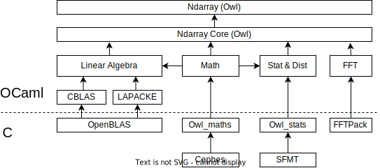

# Owl - OCaml Scientific Computing 

Owl is a dedicated system for scientific and engineering computing. The system is developed in OCaml and licensed under MIT. The project is originated by [Liang Wang](https://liang.ocaml.xyz) and currently led by [Jianxin Zhao](https://jianxin.ocaml.xyz). The history of the project is on the [Wikipedia](https://en.wikipedia.org/wiki/Owl_Scientific_Computing).

## Installation

Please follow the [tutorial](https://ocaml.xyz/tutorial/chapters/introduction.html) about installing Owl. 

## Mission

Our mission is to push the frontier of high-performance scientific computing, provide both researchers and industry programmers a powerful framework to write concise, fast and safe analytical code. The system aims to serve as the de-facto tool for computation intensive tasks in OCaml.
Owl is the de-facto scientific computing library in OCaml. Currently we aim to actively maintain it and keep it stable, utilizing the limited time and human resource we have.

The current code base is designed to be concise and self-contained. 
We encourage anyone who would like to build up their own tools based on Owl to create new repositories in the [Owlbarn](https://github.com/owlbarn) organization. 

## Owl Team 

To achieve this mission, we are assembling an *Owl Team*. Anyone who can potentially give sufficient contributions recognized by the community can request to be a team member.
A team member is expected to make several valuable and significant contributions to the project in both quality and quantity. 
Typically a committer focuses on one specific aspect of the project and is a domain expert. 
We hope but cannot guarantee that the team members can cover all aspects of the code base.

Emphasis are put on the responsibility of each team member.
Each one should take responsibility of certain aspects of the code base, e.g. a module or maintenance for a specific OS platform.
Team members, together with their domain aspects and responsibilities, will be listed here and also on the [Owl website](https://ocaml.xyz/).

For anyone who is willing to contribute, some good starting points could be:
- Participate in discussion in issues, and help to fix them
- Fix [documentations](https://ocaml.xyz/docs/), mainly by changing the `.mli` files in the source code, based on which the documentations are generated
- Fix [tutorials](https://ocaml.xyz/tutorial/); the code could be not runnable, or the content could not display properly
- Add more examples and tests
- Fix issues listed in the [TODO list](https://github.com/orgs/owlbarn/projects/2/views/2)
- Propose to fix/improve anything that interests you during using Owl
- ... 

**Current team member:**

- [@jzstark](https://github.com/jzstark): Project leader. Manage overall architecture, roadmap，and tech vision. Community communication. Set research agenda.
- [@ryanrhymes](https://github.com/ryanrhymes): Potential commercialization, business opportunity & funding seeking.

## Code of Contributing 

In principle any change to the code base is made via a GitHub Pull Request (PR). Pull requests must be reviewed and approved by at least two key developers in the Owl Team.

Team members are responsible for the issues and PRs concerning the domain aspects they claim, and are also responsible for fixing the problems caused by accepting such PRs.

If a PR is large or involves significant update or changes to the code structure, an issue should be submitted for the community and team members to discuss, and it then can be decided by the corresponding team member and project leader.

If an issue or PR does not belong to any team member's domain aspect, the response will also be on a best-effort basis with no guaranteed response time. 

Please check the full [contributing rules](CONTRIBUTING.md) and [code of conduct](CODE_OF_CONDUCT.md) of the Owl project for more detail. 

## Community 

The Owl community is based on the [OCaml Discourse](https://discuss.ocaml.org/) and [Owl Slack channel](https://owl-dev-team.slack.com/).  All participants in the community are encouraged to provide support for new users within the project management infrastructure. Those seeking technical support should also recognize that all support activities within the project is voluntary and is therefore provided as and when time permits.

## Owl Code Structure 

To help potential developers to understand the structure of Owl, here we briefly describe its overall design. More detailed description can be found in the [documentation](https://ocaml.xyz/docs/) and the Owl [books](https://ocaml.xyz/).

Owl provides a basic data structure for modern numerical computing: n-dimensional array (Ndarray). It is based on the mathematics, linear algebra, and statistics functions, which are built on both OCaml and C functions and libraries. 

Sharing the same set of interface with Ndarray is the `base` system data architecture, which is implemented in pure OCaml. It is also based on modules that are implemented in OCaml. However, though it is sufficient for daily use for normal computing, the base version Ndarray does not implement some advanced functions as in the previous Owl version Ndarray, and its performance is understandably much slower.

Besides these two types of Ndarray, another type is CGraph-Ndarray, which can be used to support symbolic style computing like TensorFlow v1. It facilitate building computation graph and computation optimization. 
The CGraph-Ndarray can be built up by wrapping up either of the previous two types of Ndarray, which are used for actual execution of computing.
All three types of Ndarray can be used to support advanced computing modules, including algorithmic differentiation, optimization, and neural networks.
